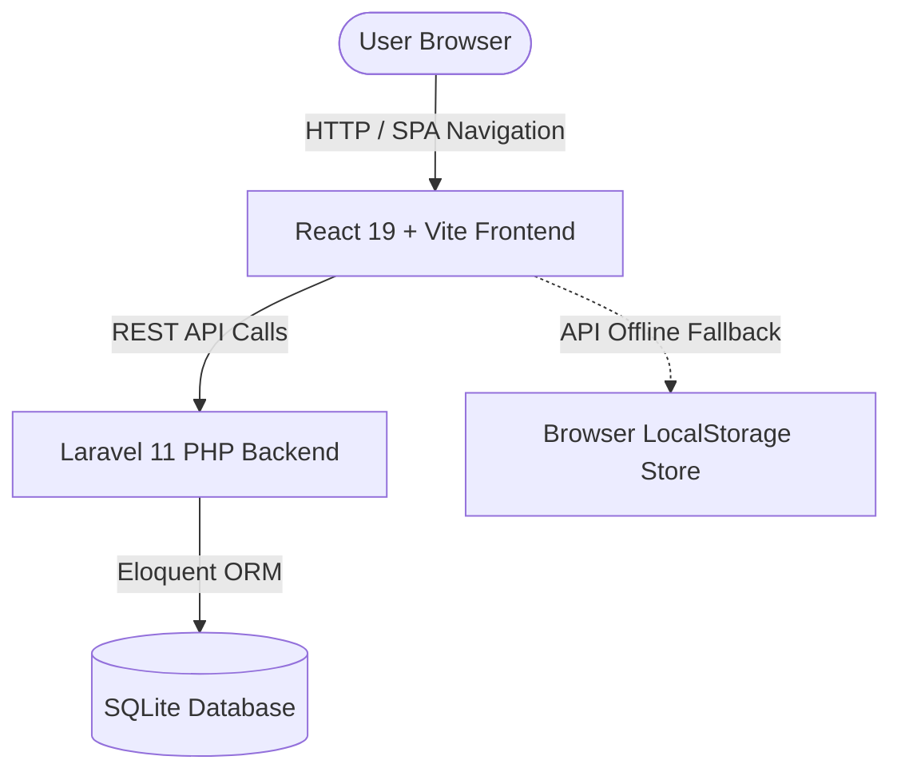

# AgileBoard — Developer & Contributor Guide 🛠️

Welcome to the **AgileBoard** developer guide. This document provides a complete architectural overview, codebase directory map, state management explanation, API reference, and a step-by-step guide for future developers looking to extend or maintain this repository.

---

## 📁 Repository Structure & Directory Map

```text
forge2-qualifier-karan-main/
├── README.md                      # Primary project overview & submission links
├── DEVELOPER_GUIDE.md             # This comprehensive developer architecture guide
├── ARCHITECTURE.md                # AI agent orchestration & model routing logic
├── agent-log.md                   # Unedited execution logs of Hermes & OpenClaw
├── build.js                       # Node.js production build bundler script
├── docker-compose.yml             # Docker container orchestration config
├── package.json                   # Root package definition (npm run dev & build)
│
├── frontend/                      # React 19 + Vite Frontend Web App
│   ├── index.html                 # Main HTML entry point
│   ├── package.json               # Frontend dependencies & scripts
│   ├── vite.config.js             # Vite bundler configuration
│   └── src/
│       ├── main.jsx               # React DOM root renderer
│       ├── App.jsx                # React Router v7 routes setup
│       ├── index.css              # Editorial Calm design system & CSS tokens
│       ├── components/
│       │   └── AnimatedIdeMockup.jsx # Real-time auto-typing AI pair-programming simulator
│       └── pages/
│           ├── LandingPage.jsx    # Hero section, AI timeline, features & footer
│           └── Board.jsx          # Interactive Kanban workspace (Drag-and-Drop, Offline Fallback)
│
├── backend/                       # Laravel 11 REST API Backend (PHP 8.3)
│   ├── artisan                    # Laravel command line interface tool
│   ├── composer.json              # PHP dependencies configuration
│   ├── app/
│   │   ├── Http/Controllers/
│   │   │   └── KanbanController.php # Core REST API controller for Boards, Lists, Cards
│   │   └── Models/
│   │       ├── Board.php          # Board Eloquent model
│   │       ├── BoardList.php      # Swimlane column Eloquent model
│   │       ├── Card.php           # Task card Eloquent model
│   │       ├── Member.php         # Team member Eloquent model
│   │       └── Tag.php            # Categorization tag Eloquent model
│   ├── database/
│   │   ├── database.sqlite        # Primary SQLite database file
│   │   ├── migrations/            # Database table schema migrations
│   │   └── seeders/               # Pre-populated demo data seeders
│   └── routes/
│       └── api.php                # REST API endpoint route definitions
│
└── evidence/                      # Submission evidence & artifacts
    ├── walkthrough.mp4            # Demo video screen recording
    ├── screenshots/               # High-resolution light & dark theme SVGs
    └── slack_export/              # Raw Slack conversation JSON transcripts
```

---

## 🏗️ Architecture Overview

AgileBoard follows a **Decoupled Architecture**:



1. **Frontend**: React 19 SPA powered by Vite, styled with custom Vanilla CSS tokens (no heavy external CSS framework overhead). Uses `framer-motion` for fluid transitions and `lucide-react` for clean SVG iconography.
2. **Backend**: Laravel 11 running PHP 8.3 with an embedded SQLite store for zero-config local development.
3. **Resilient LocalStorage Fallback**: If the backend server is unreachable, the frontend automatically falls back to an in-browser `localDB` engine seamlessly so the app is always 100% interactive.

---

## 📡 REST API Reference

All backend API endpoints are prefix-scoped to `/api`:

| Method | Endpoint | Description |
| :--- | :--- | :--- |
| `GET` | `/api/boards` | Fetch list of all Kanban boards |
| `POST` | `/api/boards` | Create a new Kanban board |
| `GET` | `/api/boards/{id}` | Fetch board details with swimlane lists & cards |
| `DELETE` | `/api/boards/{id}` | Delete a board and its associated cards |
| `POST` | `/api/lists` | Add a new swimlane column to a board |
| `DELETE` | `/api/lists/{id}` | Remove a swimlane column |
| `POST` | `/api/cards` | Create a new task card |
| `PUT` | `/api/cards/{id}` | Update card title, description, due date, list_id, tags, or assignees |
| `DELETE` | `/api/cards/{id}` | Delete a task card |
| `POST` | `/api/seed-demo` | Reset database and seed pre-populated demo Kanban board |

---

## 🧭 Key Components Map

### 1. `frontend/src/pages/LandingPage.jsx`
- **Purpose**: Main entry landing page (`/`).
- **Key Sections**: Top Nav, Hero Title, Animated IDE Mockup, Designed Features Grid, AI Timeline Blueprint, Database Mode Comparison, and Functional Footer.
- **State**: Dark mode theme toggle (`darkMode`), responsive navigation.

### 2. `frontend/src/components/AnimatedIdeMockup.jsx`
- **Purpose**: Real-time auto-typing AI pair-programming simulation on the landing page.
- **Key Features**:
  - Auto-typing engine with blinking cursor (`|`) and syntax highlighting.
  - Multi-agent dialogue log (`Hermes`, `OpenClaw`, `System`).
  - Active file explorer highlighting.
  - Controls: Play/Pause, Reset, Speed Multiplier (1x/2x), and Step Tab selectors.

### 3. `frontend/src/pages/Board.jsx`
- **Purpose**: Full Kanban workspace (`/board`).
- **Key Features**:
  - HTML5 Drag and Drop card reordering across swimlanes.
  - Card CRUD modal (Title, Description, Due Date, Member Assignees, Tag Badges).
  - Overdue date detection with soft crimson boundary glow.
  - Dual Mode: Communicates with Laravel API backend or falls back to `localStorage`.

### 4. `frontend/src/index.css`
- **Design System**: Built around the Cursor brand guidelines.
- **Theme Variables**:
  - Light Mode Canvas: `--bg-app: #f4f4f0` (Warm Cream)
  - Dark Mode Canvas: `--bg-app: #0b0b0e` (Near-black Slate)
  - Brand Accent: `--accent-primary: #f54e00` (Cursor Orange)

---

## 🛠️ Step-by-Step Extension Guide for Future Developers

### Scenario A: How to Add a New Field to Kanban Cards (e.g. Priority Level)

1. **Update Backend Database Migration**:
   Edit `backend/database/migrations/xxxx_xx_xx_create_cards_table.php`:
   ```php
   $table->enum('priority', ['low', 'medium', 'high'])->default('medium');
   ```
2. **Update Backend Model & Controller**:
   - In `backend/app/Models/Card.php`, add `'priority'` to `$fillable`.
   - In `backend/app/Http/Controllers/KanbanController.php`, validate and save `$request->priority`.
3. **Update Frontend UI**:
   - In `frontend/src/pages/Board.jsx`, add priority badge renderer in card cards and priority dropdown select inside `CardModal`.
   - In `localDB` helper in `Board.jsx`, update local storage fallback data schema.

### Scenario B: How to Add a New Page Route

1. Create new page component in `frontend/src/pages/NewPage.jsx`.
2. Register route in `frontend/src/App.jsx`:
   ```jsx
   <Route path="/new-page" element={<NewPage />} />
   ```

---

## ⚡ Local Development Commands Summary

```bash
# 1. Run Frontend Development Server (from root directory)
npm run dev

# 2. Build Frontend for Production (from root directory)
npm run build

# 3. Run Backend Laravel Server (from backend directory)
cd backend
php artisan serve
```

---

*Maintained with Editorial Calm for the Forage 2 Qualifier Edition.*
