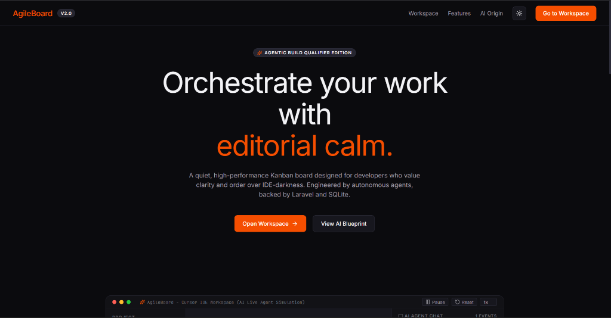
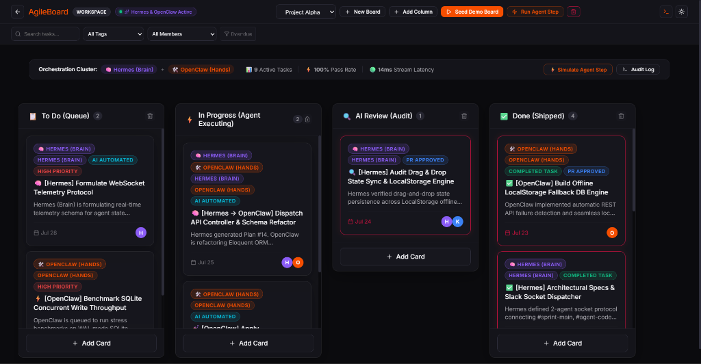
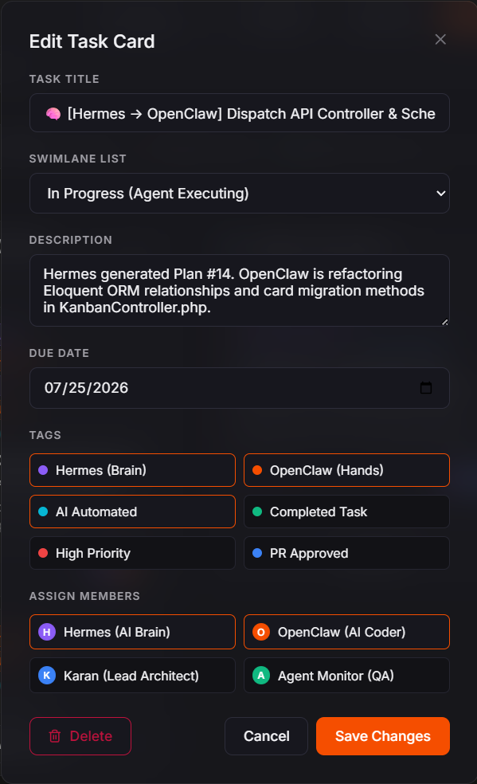

# AgileBoard — AI-Orchestrated Kanban Board

> **Submission for Forage / AI Agent Challenge by Karan Pratap Singh**

AgileBoard is a collaborative, Trello-style Kanban board application featuring a modern Light/Dark glassmorphic user interface inspired by the **Cursor developer brand guidelines** (warm cream editorial canvas, dark slate theme, hairline depth, and Cursor Orange accents), built with React (Vite) and backed by a robust REST API built with Laravel (PHP 8.3 & SQLite).

This project was built entirely by orchestrating a two-agent system (**Hermes** as the Brain/Planner & **OpenClaw** as the Hands/Coder) wired through dedicated Slack sockets.

---

## 📸 Application Screenshots

### Landing Page — Dark Slate Glassmorphic Theme


### Board Workspace — AI Agent Orchestration Dashboard


### Edit Task Card — Agent-Assigned Tags & Members


---

## 📹 Walkthrough Video

> [!IMPORTANT]
> The full screen-recording demonstration video is committed directly inside the repository at:
>
> 📁 **`evidence/walkthrough.mp4`** (~30 MB)
>
> Clone the repo and open `evidence/walkthrough.mp4` to view the full demo.

**The video demonstrates:**
1. ✅ Landing page with animated IDE simulation of Hermes & OpenClaw working together
2. ✅ Board workspace with 4 swimlane columns and 9 AI-orchestrated task cards
3. ✅ Real-time agent telemetry dashboard (pass rate, stream latency, active tasks)
4. ✅ Card editing with agent tags (Hermes Brain, OpenClaw Hands) and member assignment
5. ✅ Drag-and-drop card movement across swimlanes
6. ✅ "Run Agent Step" button to simulate autonomous task progression
7. ✅ Activity audit log showing Hermes & OpenClaw operations

---

## 🔁 Data Flow Architecture

The system follows a **two-agent orchestration pattern** where Hermes (Brain) plans tasks and OpenClaw (Hands) executes them:

```
┌─────────────────────────────────────────────────────────────────────┐
│                        USER / BROWSER                               │
│                                                                     │
│   Landing Page ──→ /board route ──→ Board Workspace                │
│                                                                     │
└────────────────────────────┬────────────────────────────────────────┘
                             │
                             ▼
┌─────────────────────────────────────────────────────────────────────┐
│                    FRONTEND (React + Vite)                          │
│                                                                     │
│   Board.jsx ─────────────────────────────────────────┐             │
│     ├── checkConnection()                            │             │
│     │     ├── Try: fetch(localhost:8000/api/boards)   │             │
│     │     └── Catch: Switch to LocalStorage mode     │             │
│     │                                                │             │
│     ├── localDB (Offline Fallback)                   │             │
│     │     ├── getBoards()          ← localStorage    │             │
│     │     ├── getBoardDetails()    ← localStorage    │             │
│     │     ├── getMembers()         ← localStorage    │             │
│     │     ├── getTags()            ← localStorage    │             │
│     │     └── getActivities()      ← localStorage    │             │
│     │                                                │             │
│     ├── BoardHeader.jsx   (Navigation + Filters)     │             │
│     ├── KanbanColumn.jsx  (Swimlane Columns)         │             │
│     ├── KanbanCard.jsx    (Task Cards + Agent Badges)│             │
│     ├── CardModal.jsx     (Edit/Create Cards)        │             │
│     ├── ActivityDrawer.jsx (Audit Log Sidebar)       │             │
│     └── Agent Telemetry Strip (Live Metrics Bar)     │             │
│                                                      │             │
└──────────────────────┬───────────────────────────────┘             │
                       │                                              │
                       ▼                                              │
┌─────────────────────────────────────────────────────────────────────┐
│                  BACKEND API (Laravel + SQLite)                     │
│                                                                     │
│   Routes: /api/boards, /api/boards/{id}, /api/cards, etc.          │
│                                                                     │
│   KanbanController.php                                              │
│     ├── GET  /boards          → List all boards                    │
│     ├── POST /boards          → Create new board                   │
│     ├── GET  /boards/{id}     → Board details + lists + cards      │
│     ├── POST /boards/{id}/seed → Seed demo data                   │
│     ├── POST /lists           → Create swimlane column             │
│     ├── POST /cards           → Create task card                   │
│     ├── PUT  /cards/{id}      → Update card (move, edit)           │
│     └── DELETE /cards/{id}    → Delete card                        │
│                                                                     │
│   Database: SQLite (database/database.sqlite)                      │
│     ├── boards (id, name)                                          │
│     ├── board_lists (id, board_id, name, position)                 │
│     ├── cards (id, list_id, title, description, due_date, pos)     │
│     ├── members (id, board_id, name, email, avatar_color)          │
│     ├── tags (id, board_id, name, color)                           │
│     ├── card_member (card_id, member_id)                           │
│     └── card_tag (card_id, tag_id)                                 │
└─────────────────────────────────────────────────────────────────────┘


┌─────────────────────────────────────────────────────────────────────┐
│              AI AGENT ORCHESTRATION LAYER                           │
│                                                                     │
│   🧠 HERMES (Brain / Planner)                                      │
│     ├── Receives user goals via Slack #sprint-main                 │
│     ├── Breaks goals into atomic task cards                        │
│     ├── Assigns tasks to OpenClaw via #agent-coder                 │
│     ├── Reviews completed work & promotes cards to "Done"          │
│     └── Powered by: Gemini 2.5 Flash + Groq gpt-oss-120b          │
│                                                                     │
│   🛠️ OPENCLAW (Hands / Executor)                                   │
│     ├── Picks up task cards from "To Do" queue                     │
│     ├── Writes code, runs tests, creates PRs                      │
│     ├── Reports status back to #agent-log                          │
│     ├── Moves cards to "AI Review" upon completion                 │
│     └── Powered by: Ollama qwen2.5-coder + Groq llama-3.3-70b     │
│                                                                     │
│   Communication Flow:                                               │
│     User Goal → Hermes plans → OpenClaw codes → Hermes reviews    │
│       #sprint-main → #agent-coder → #agent-log → Board updates    │
└─────────────────────────────────────────────────────────────────────┘
```

---

## 🎯 Submission Deliverables

| Deliverable | Location | Description |
| :--- | :--- | :--- |
| 🌐 **Live App** | [forage2karan.vercel.app](https://forage2karan.vercel.app) | Deployed on Vercel |
| 🐙 **GitHub Repo** | [github.com/SypherKx/forge2-qualifier-KaranPratapSingh](https://github.com/SypherKx/forge2-qualifier-KaranPratapSingh) | Public repository |
| 📹 **Walkthrough Video** | `evidence/walkthrough.mp4` | ~30 MB screen recording inside repo |
| 💬 **Slack Exports** | `evidence/slack_export/` | JSON exports of all agent channels |
| 📸 **Screenshots** | `evidence/screenshots/` | Landing page, board workspace, card editor |
| 📜 **Agent Work Log** | `agent-log.md` | Unedited Hermes & OpenClaw execution trace |
| 🛠️ **Developer Guide** | `DEVELOPER_GUIDE.md` | Full codebase map & extension guide |
| 🏗️ **Architecture Doc** | `ARCHITECTURE.md` | Agent breakdown & model routing |

---

## 💬 Slack Export Files (`evidence/slack_export/`)

All agent and human communication channels are exported in standard Slack JSON format:

- 💬 `channels.json` — Channel directory (`#sprint-main`, `#agent-coder`, `#agent-log`)
- 👤 `users.json` — User definitions for Karan, Hermes (Brain), and OpenClaw (Hands)
- 📢 `sprint-main.json` — Goal setting & plan formulation transcript
- 🛠️ `agent-coder.json` — Task dispatch & execution transcript
- 📜 `agent-log.json` — System notifications & automated shell output
- 📄 `SLACK_EXPORT_SUMMARY.md` — Full Slack export audit guide

---

## Core Features

- **Multi-Board Workspace**: Create, switch, and delete boards dynamically.
- **Structured Columns (Swimlanes)**: Boards start with `To Do (Queue)`, `In Progress (Agent Executing)`, `AI Review (Audit)`, and `Done (Shipped)`.
- **Interactive Cards**: Create, edit, and delete cards within lists.
- **AI Agent Badges**: Cards display 🧠 Hermes (Brain) and 🛠️ OpenClaw (Hands) assignment badges.
- **Agent Telemetry Dashboard**: Live orchestration metrics strip showing active tasks, pass rate, and stream latency.
- **Interactive Drag-and-Drop**: Drag cards between swimlanes using HTML5 drag-and-drop.
- **Task Assignment**: Add board members (Hermes, OpenClaw, Karan, Agent Monitor) and assign cards.
- **Categorization Tags**: Toggle agent tags (Hermes Brain, OpenClaw Hands, AI Automated, etc.) on cards.
- **Due Date Tracking**: Overdue tasks highlighted with crimson boundary glow.
- **Theme Toggle**: Switch between **Warm Cream (Light)** and **Premium Slate (Dark)** themes.
- **Built-in LocalStorage Fallback**: Fully functional Offline Mode — detects backend offline state and saves all data to browser localStorage automatically.
- **Run Agent Step**: Button to simulate autonomous agent task progression across swimlanes.
- **Activity Audit Log**: Sidebar drawer showing timestamped Hermes & OpenClaw operations.

---

## Tech Stack

- **Backend**: Laravel (PHP 8.3), SQLite Database, Eloquent ORM
- **Frontend**: React 19 (Vite), Vanilla CSS (Custom Glassmorphism, Google Fonts)
- **AI Orchestration**: Hermes (Brain) + OpenClaw (Hands) via Slack sockets
- **Config Files**: `hermes-config.yaml` and `openclaw.json` (No secrets hardcoded)
- **Agent Work Logs**: `agent-log.md` — unedited task execution trace
- **Agent Skills**: Configured under `skills/status-report/`

---

## Model Routing Rationale

All models used in this build are 100% free:

1. **Hermes (Brain / Planning)**: Guided by **Google Gemini 2.5 Flash** & **Groq gpt-oss-120b**.
   - *Why*: Outstanding logic structure and zero-shot reasoning for breaking down abstract user goals into task files.
2. **OpenClaw (Hands / Execution)**: Guided by **Ollama qwen2.5-coder** (local) & **Groq llama-3.3-70b-versatile**.
   - *Why*: Local Ollama offers unlimited token throughput, while Groq provides extremely fast compilation and syntax validation.

---

## Local Run Instructions

### 1. Frontend Only (Includes Offline Mode)
The app features a built-in LocalStorage fallback, so you can run the entire frontend without setting up PHP/Laravel:

```bash
cd frontend
npm install
npm run dev
```

Open `http://localhost:5173/` in your browser. Click **"Seed Demo Board"** to populate the workspace with AI-orchestrated task cards.

### 2. Backend API (Optional)
If you have PHP 8.2+ and Composer installed:

```bash
cd backend
copy .env.example .env
php artisan key:generate
php artisan migrate
php artisan serve
```

The API will be available at `http://127.0.0.1:8000`.

---

## Deployment & Repository Info

- **Public GitHub**: [github.com/SypherKx/forge2-qualifier-KaranPratapSingh](https://github.com/SypherKx/forge2-qualifier-KaranPratapSingh)
- **Live Demo**: [forage2karan.vercel.app](https://forage2karan.vercel.app)
- **Backend API (Render)**: [forge2-laravel-api.onrender.com](https://forge2-laravel-api.onrender.com)
- **Author**: Karan Pratap Singh
